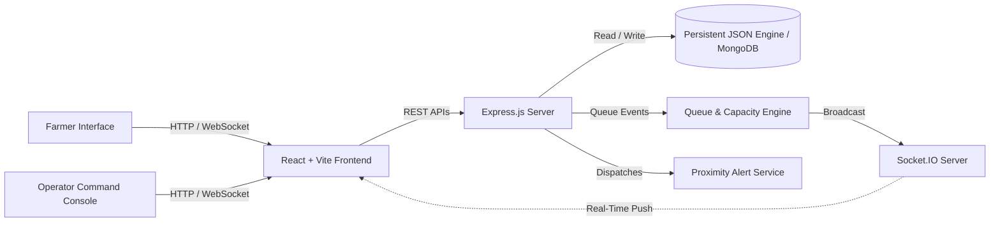

# Kisan Setu — Smart Digital Procurement & Queue Management System for Farmers

> **Tagline:** “Farmers should spend their time farming, not waiting.”  
> **Problem Statement:** Student Innovation — Farmers Problem (PS Code: SIH26032)  
> **Category:** Software  
> **Team:** White Raven  
> **Team Leader:** Vicky Kumar  
> **Institute:** Govind Ballabh Pant Institute of Engineering & Technology (GBPIET), Pauri Garhwal, Uttarakhand  

---

## 1. Problem Statement

At physical Agricultural Produce Market Committee (APMC / Mandi) procurement centres across India, farmers currently experience severe logistical bottlenecks:
* **Zero Queue Visibility:** Farmers arrive at mandi yards without knowing how many tractor-trolleys are ahead in line.
* **Painful 8–14 Hour Delays:** Prolonged waiting in crowded, unshaded yards causes physical exhaustion and economic disruption.
* **Crop Deterioration Risk:** Perishable or harvested grains exposed to humidity or sudden rain in open-air yards undergo moisture spikes, resulting in grade downgrades or distress selling.
* **Capacity Surges & Traffic Congestion:** Unscheduled arrivals overwhelm weighbridges, testing labs, and surrounding highways.
* **Lack of Transparent Billing:** Manual slips for gross/tare weight and grading create friction and uncertainty regarding Direct Benefit Transfer (DBT) disbursement.

---

## 2. The Kisan Setu Solution

**Kisan Setu** transforms this uncoordinated, manual process into a structured, transparent, digital public workflow:
1. **Scheduled Slot Reservation:** Farmers choose an available time slot at their nearest mandi centre.
2. **Instant Digital Token:** Receive a digital pass with a verified token number (e.g. `A127`) and QR code.
3. **Deterministic Real-Time Queue:** Track live queue movement on mobile without standing in the yard.
4. **Smart Proximity Alerts:** Automatic notifications triggered at:
   - **5 Ahead:** Prepare to proceed to the centre.
   - **2 Ahead:** Proceed directly to the procurement counter.
   - **Position 1 (Turn Now):** Report immediately to Counter 2 (Weighbridge).
5. **Digital Weighing & Grading:** Operator enters Gross Weight and Tare Weight; Net Weight is computed automatically. Moisture and foreign matter are evaluated against official FCI standards.
6. **Instant Transparent Billing & DBT Receipt:** Generates an official payment advice (e.g., ₹27,600 for 1,200 kg Grade A Wheat) with transaction UTR.
7. **Offline-First Resilience:** Rural connectivity toggle provides cached tokens and simulated SMS fallback delivery for basic feature phones.

---

## 3. System Architecture



---

## 4. Key Features

* **Bilingual Support (English | हिन्दी):** Full agricultural vocabulary with natural Hindi translations across forms, queue terms, and receipts.
* **Deterministic Live Queue:** Sequential queue progression (`08 → 07 → ... → 01`) with automatic alert dispatching.
* **Operator Command Centre:** Real-time yard capacity gauge (with >90% overload warning), served/waiting metrics, public address call-out, and pause/resume controls.
* **Electronic Weighbridge & Lab Module:** Automated calculation of Net Weight (`Gross - Tare`), FCI Grade assessment (Grade A/B/C/Rejected), and MSP rate application.
* **Simulated PFMS / DBT Payment:** Transparent bill generation with simulated UTR number (`KS2026091500127`).
* **Offline Mode & SMS Ticket:** Demonstrates low-connectivity caching and simulated SMS alert modal.
* **Interactive 10-Step Demo Controller:** Floating presenter bar allowing evaluators to step through the entire hackathon narrative with a single click.
* **Analytics Engine:** Recharts-powered graphs for daily farmers served, hourly arrival load, crop distribution, and DBT payment status.

---

## 5. Tech Stack

### Frontend
* **Framework:** React 18 with Vite
* **Language:** TypeScript
* **Styling:** Tailwind CSS (Modern Agri-Tech Government Palette)
* **Icons:** Lucide React
* **Charts:** Recharts
* **Routing:** React Router v6
* **Real-time Client:** Socket.IO Client

### Backend
* **Runtime:** Node.js (v18+)
* **Framework:** Express.js
* **Real-time Engine:** Socket.IO
* **Database:** Zero-config Persistent JSON File Database with ACID write safety (seamlessly swappable with MongoDB via Mongoose)

---

## 6. Quick Start & Installation

### Prerequisites
* Node.js (v18 or higher)
* npm (v9 or higher)

### Installation Commands

```bash
# Clone the repository
git clone https://github.com/vicky-kumar/kisan-setu.git
cd kisan-setu

# Install root, backend and frontend dependencies
npm run install:all
```

### Running the Application

#### Option A: Unified Full-Stack Run (Recommended)
Builds the client and starts the backend server serving both API and UI on a single port:

```bash
npm run build:client
npm start
```
Access the application at: **`http://localhost:5001`**

#### Option B: Independent Development Servers
In terminal 1 (Backend API):
```bash
npm run server
# Runs Express on http://localhost:5001
```

In terminal 2 (Frontend Dev Server):
```bash
npm run client
# Runs Vite on http://localhost:3000
```

---

## 7. Demo Credentials

### 👨‍🌾 Farmer Login
* **Mobile Number:** `9876543210`
* **Demo OTP:** `123456`
* **Active Token:** `A127` (Vicky Kumar)
* *Note: A 1-Click "Quick Demo Farmer Login" button is also provided on the login page.*

### 🏢 Operator Console Login
* **Operator ID:** `operator@kisansetu.demo`
* **Password:** `demo123`
* *Note: A "Fill Demo" button is provided on the operator login screen.*

---

## 8. 5–7 Minute Hackathon Presentation Sequence

The bottom of the screen includes a floating **"🎬 SIH Hackathon Presentation Demo"** control bar. Presenters can use the **Next Step** button to walk through the narrative:

1. **Scene 1 — The Problem:** Open Landing Page. Highlight the 8–14 hour mandi waiting bottleneck and crop deterioration risk.
2. **Scene 2 — Farmer Token:** View Vicky Kumar's active pass: **Token A127**, Queue Position **08**, 7 farmers ahead, Estimated turn **11:40 AM**.
3. **Scene 3 — Scheduled Booking:** Demonstrate how farmers can select a centre, crop, date, and available time slot in 4 simple steps.
4. **Scene 4 — Operator Command Centre:** Switch to Operator view at Pauri Procurement Centre. Review the 82% capacity load, 146 served, 23 waiting.
5. **Scene 5 — Real-Time Queue Advancement:** Operator clicks *"Mark Next Farmer Served"*. Show how the queue advances in real-time across tabs without page reloads.
6. **Scene 6 — Proximity Alert:** At 5 and 2 farmers ahead, show how the smart alert banner and SMS fallback ticket guide the farmer to travel to the yard.
7. **Scene 7 — Weighbridge Counter:** Enter Gross Weight (1,250 kg) and Tare Weight (50 kg). Net Weight (1,200 kg) is automatically computed.
8. **Scene 8 — Quality Lab:** Inspect moisture (12.0%) and foreign matter (1.5%). Approve Grade A certification.
9. **Scene 9 — Bill Generation:** View generated MSP procurement bill: ₹27,600.
10. **Scene 10 — Direct Benefit Transfer (DBT):** View final settlement advice and printable digital receipt with transaction UTR `KS2026091500127`.

---

## 9. Future Scope & Production Roadmap

* **Government PM-KISAN & e-NAM Integration:** Direct API handshake with National Agriculture Market (e-NAM) and state food civil supplies portals.
* **Aadhaar / DigiLocker KYC:** Automated land record verification via state revenue department APIs (Bhulekh).
* **Automated Weighbridge Telemetry:** Direct IoT serial communication (RS-232 / Modbus) from physical weighbridge load cells into the database.
* **Multilingual IVR / Voice Assistant:** Interactive voice response in regional dialects (Garhwali, Kumaoni, Bhojpuri, etc.) for non-smartphone users.
* **Edge / Offline Sync Engine:** Offline CRDT-based synchronization for high-altitude hilly centres with intermittent satellite connectivity.

---

## 10. License & Credits

Developed with ❤️ by **Team White Raven**  
Institute: Govind Ballabh Pant Institute of Engineering & Technology (GBPIET), Pauri Garhwal, Uttarakhand  
Smart India Hackathon 2026 (SIH26032)
